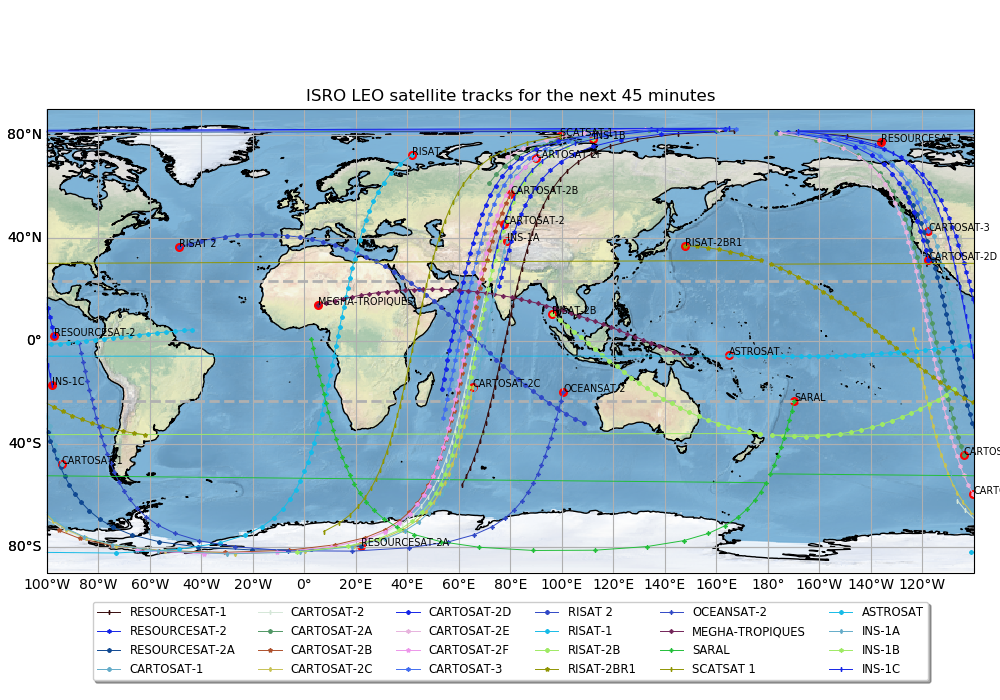
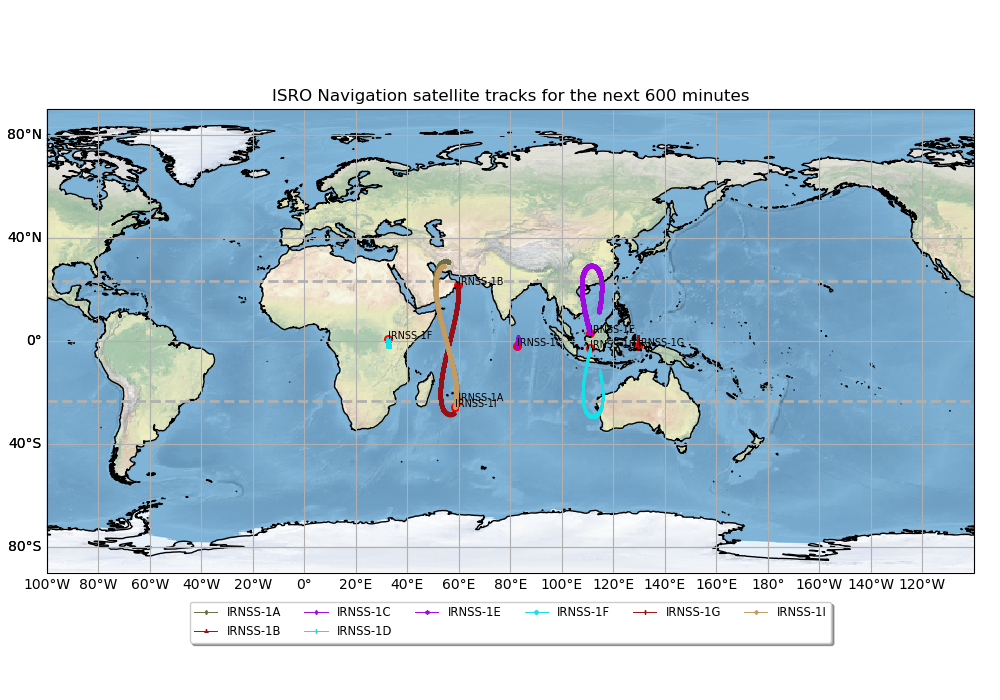
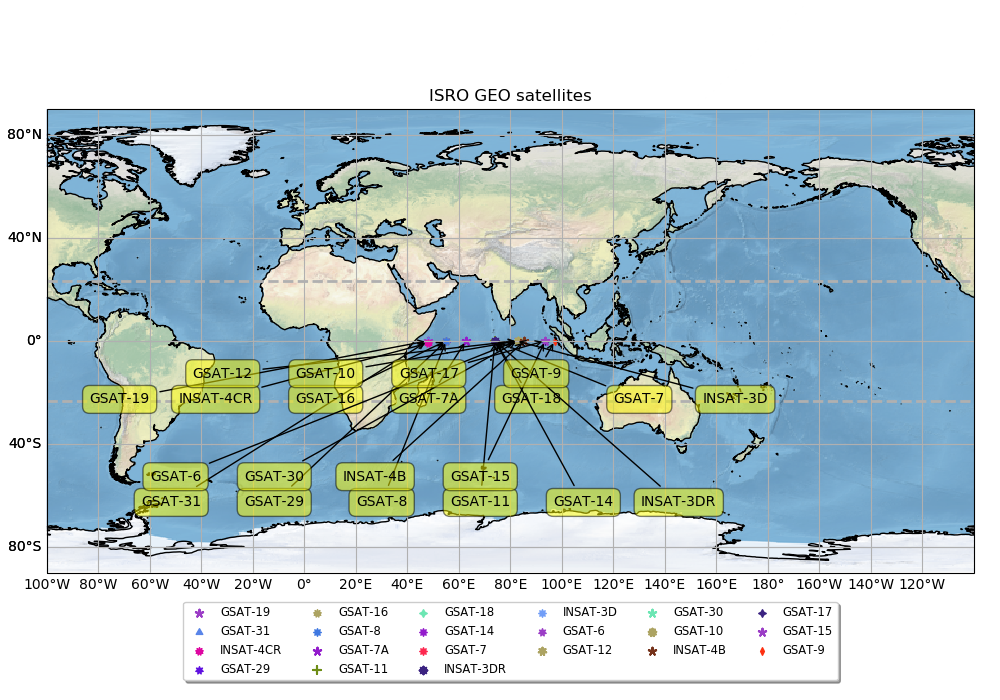

# Satellite Tracker
> This script tracks and maps predicted orbits paths (from the current time) for ISRO managed satellites. Categorized and plotted as LEO maps (low earth orbit satellites), NAV maps (navigational satellites) and GEO maps (communication satellites).    

## Table of contents
* [General info](#general-info)
* [Screenshots](#screenshots)
* [Setup](#setup)
* [How to run ](#how)
* [To-do list](#to-do)

## General info
Current version of this project is written for satellites operated and managed by ISRO (Indian Space Research Organization). Program creates a local TLE file, specifically grouped for all ISRO managed satellites from celestrak.com. For further usage program will use it from locally created TLE file and will be updated once in 2 weeks based on the TLE timestamp.   
&nbsp;   
LEO orbit will be predicted for the user supplied time in minutes. Default value is 30 minutes.    
Line no.298 on the code can be modified accordingly.
`tracking_minutes = 45`   

Red circle on the map shows the satellites current position (with satellites name on it) and the orbit track with a unique marker.   

&nbsp;   
NAV maps shows the track of navigational satellites. As this is a slow moving one, I have kept the variable value as,    
`tracking_minutes = 600`   

&nbsp;   
GEO maps shows the location of the communication satellites. As they are located in close proximity, there are huge overlaps on the satellite markers.    

## Screenshots
Output maps generated by the script.    
   
 

## Setup
Script is written with python (Version: 3.6) on linux. Additional modules required :   

* numpy  (tested with Version: 1.18.4 )
* matplotlib  (tested with Version: 2.1.1 )
* skyfield (tested with Version: 1.22)
* Cartopy ( tested with Version: 0.18.0 )
    * requires Shapely (1.7.0)

## How to run   
* Verify and install required modules 
* run `python satellite_tracker.py`. 
* It generates three png files (LEO map, NAV map and GEO map) at the current directory and opens the plot window one by one.  
* If image files are not needed, change the flag to False on the code at line no.300 which reads    
* `savePng = True` to `savePng = False` 

## To-do list
* This initial version is ISRO specific and could be modified to fit other agencies.

